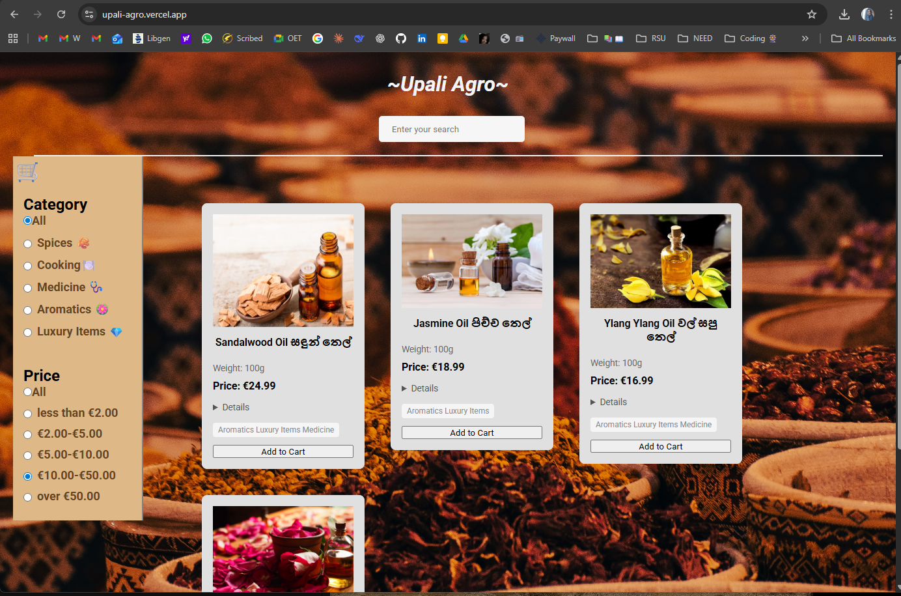

# 🛒 Upali Agro - Sri Lankan Spices E-commerce

A modern e-commerce web application showcasing authentic Sri Lankan spices, medicinal herbs, aromatics, and specialty food products. Built with React, TypeScript, and CSS Modules.

## 🌿 About

Upali Agro is a portfolio project demonstrating modern frontend development practices through an e-commerce platform for Sri Lankan agricultural products. The application features 40+ carefully curated products including premium Ceylon cinnamon, cardamom, essential oils, and traditional medicinal herbs.

## Key highlights:

* Advanced multi-criteria filtering system (search, category, price)
*  Fully typed with TypeScript for type safety
* Modular component architecture with CSS Modules
* Responsive design for mobile and desktop
* Rich product descriptions with cultural and medicinal information

## ✨ Features

### Core Functionality

* Real-time Search - Case-insensitive text search across product titles
* Category Filtering - Filter by Spices, Medicine, Aromatics, Luxury Items, and Cooking Ingredients
* Price Range Filtering - Five price tiers from under €2 to over €50
* Multi-filter Support - Combine search, category, and price filters simultaneously
* Responsive Product Cards - Detailed product information with expandable descriptions
* Fixed Sidebar Navigation - Always-accessible filter controls

### Product Catalog

* 40+ authentic Sri Lankan products
* High-quality product images
* Bilingual product names (English/Sinhala)
* Detailed descriptions including:
  - Traditional uses in Sri Lankan cuisine
  - Medicinal properties and Ayurvedic benefits
  - Cultural significance
  - Weight and pricing information

## 🛠️ Tech Stack

### Frontend Framework:

* React 19 (Functional Components + Hooks)
* TypeScript 
* Vite (Build Tool)

### State Management:

* React useState Hook
* Props drilling for component communication

### Other Tools:

* React Icons
* ESLint + TypeScript ESLint
* Vite (built)

## 📁 Project Structure
src/
├── components/
│   ├── card/
│   │   ├── Card.tsx
│   │   └── Card.module.css
│   ├── input/
│   │   ├── Input.tsx
│   │   └── Input.module.css
│   ├── navigation/
│   │   ├── Navigation.tsx
│   │   └── Navigation.module.css
│   ├── products/
│   │   ├── Products.tsx
│   │   └── Products.module.css
│   ├── sidebar/
│   │   ├── Sidebar.tsx
│   │   ├── Sidebar.module.css
│   │   ├── category/
│   │   │   ├── Category.tsx
│   │   │   └── Category.module.css
│   │   └── price/
│   │       ├── Price.tsx
│   │       └── Price.module.css
│   ├── recommended/ (planned feature)
│   └── Button.tsx
├── data/
│   └── Data.ts (Product catalog with TypeScript types)
├── App.tsx (Main application logic)
└── index.css (Global styles)

## 🔮 Future Enhancements
Planned features for future iterations:

* Add to cart functionality
* Recommended pages
* React-Router pages 
* Backend Integration
