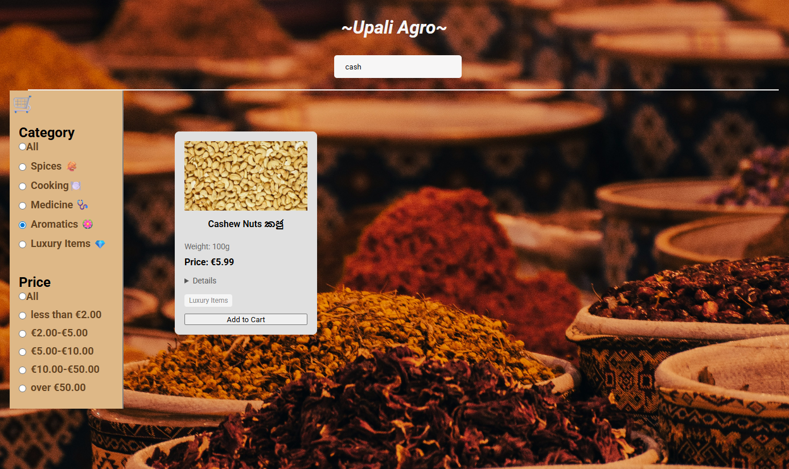
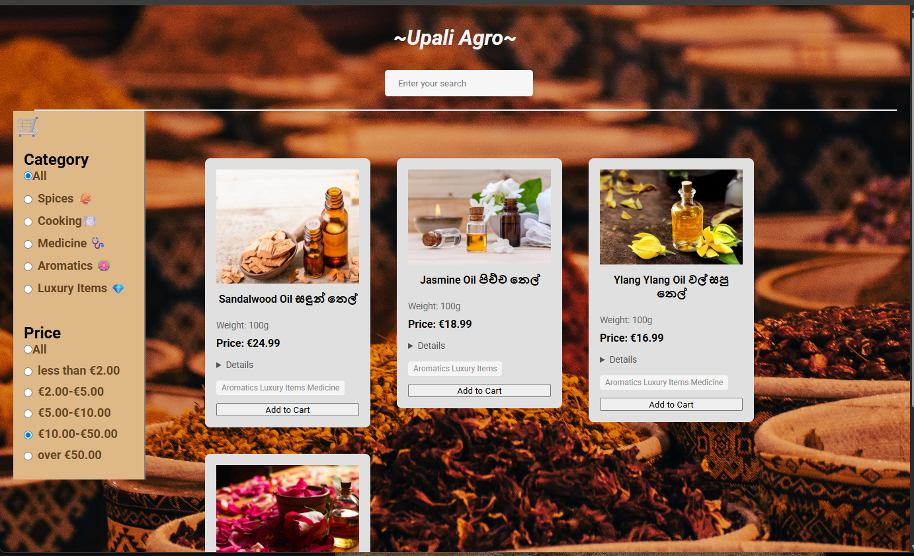

# 🛒 Upali Agro - Sri Lankan Spices E-commerce

A modern e-commerce web application showcasing authentic Sri Lankan spices, medicinal herbs, aromatics, and specialty food products. Built with React, TypeScript, and CSS Modules.


## 🌿 About

Upali Agro is a portfolio project demonstrating modern frontend development practices through an e-commerce platform for Sri Lankan agricultural products. The application features 40+ carefully curated products including premium Ceylon cinnamon, cardamom, essential oils, and traditional medicinal herbs.




## Key highlights:

* Advanced multi-criteria filtering system (search, category, price)
*  Fully typed with TypeScript for type safety
* Modular component architecture with CSS Modules
* Responsive design for mobile and desktop
* Rich product descriptions with cultural and medicinal information

## Overview

Upali Agro is a full-featured e-commerce web application specializing in authentic Sri Lankan spices, medicinal herbs, aromatics, and specialty food products. Built with modern web technologies, this application demonstrates a comprehensive understanding of React architecture, TypeScript type safety, and responsive design principles. The platform offers an intuitive shopping experience with advanced filtering capabilities, allowing users to browse through over 40 carefully curated products from Sri Lankan agricultural traditions.

## Project Description

This e-commerce application was developed as a portfolio project to showcase proficiency in modern frontend development practices. The application implements a robust product catalog system where users can search, filter, and explore traditional Sri Lankan products including premium Ceylon cinnamon, cardamom, turmeric, essential oils, and specialty vegetables. Each product features detailed descriptions highlighting cultural significance, medicinal properties, and traditional uses in Sri Lankan cuisine and Ayurvedic medicine.
The application emphasizes user experience through multiple filtering mechanisms working in concert. Users can perform text-based searches to find specific products, filter by category (spices, medicine, aromatics, luxury items, and cooking ingredients), and narrow results by price range. The filtering system is designed to handle complex queries efficiently, supporting multi-category products and dynamic price range selections. All filtering operations happen in real-time, providing immediate visual feedback as users interact with the interface.

## Technical Architecture

The application is built using React 18 with TypeScript, leveraging functional components and React Hooks for state management. The component architecture follows a modular design pattern with clear separation of concerns. The main App component serves as the central state container, managing search queries and selected filter categories, while child components handle their specific responsibilities. The Navigation component manages the search interface, the Sidebar component contains all filtering options organized by category and price, and the Products component renders the filtered results in a responsive grid layout.



TypeScript is used throughout the application to ensure type safety and improve developer experience. Custom type definitions are created for all data structures, including product types, button props, and input handlers. This approach catches potential errors at compile time and provides excellent IDE support with autocomplete and inline documentation. The data layer is structured with a strongly-typed data model that includes product images, titles, descriptions, weights, categories, and pricing information.


CSS Modules are implemented across all components to prevent style conflicts and maintain encapsulation. Each component has its own scoped stylesheet, allowing for confident styling without worrying about global namespace pollution. The styling approach combines modern CSS features including flexbox for layout, CSS transitions for smooth interactions, and media queries for responsive behavior. The visual design incorporates a warm, earthy color palette that reflects the natural, organic nature of the products.

## ✨ Features

### Core Functionality

* Real-time Search - Case-insensitive text search across product titles
* Category Filtering - Filter by Spices, Medicine, Aromatics, Luxury Items, and Cooking Ingredients
* Price Range Filtering - Five price tiers from under €2 to over €50
* Multi-filter Support - Combine search, category, and price filters simultaneously
* Responsive Product Cards - Detailed product information with expandable descriptions
* Fixed Sidebar Navigation - Always-accessible filter controls

### Product Catalog

* 40+ authentic Sri Lankan products
* High-quality product images
* Bilingual product names (English/Sinhala)
* Detailed descriptions including:
  - Traditional uses in Sri Lankan cuisine
  - Medicinal properties and Ayurvedic benefits
  - Cultural significance
  - Weight and pricing information

## 🛠️ Tech Stack

### Frontend Framework:

* React 19 (Functional Components + Hooks)
* TypeScript 
* Vite (Build Tool)

### State Management:

* React useState Hook
* Props drilling for component communication

### Other Tools:

* React Icons
* ESLint + TypeScript ESLint
* Vite (built)


## 📁 Project Structure

```
src/
├── components/
│   ├── card/
│   │   ├── Card.tsx
│   │   └── Card.module.css
│   ├── input/
│   │   ├── Input.tsx
│   │   └── Input.module.css
│   ├── navigation/
│   │   ├── Navigation.tsx
│   │   └── Navigation.module.css
│   ├── products/
│   │   ├── Products.tsx
│   │   └── Products.module.css
│   ├── sidebar/
│   │   ├── Sidebar.tsx
│   │   ├── Sidebar.module.css
│   │   ├── category/
│   │   │   ├── Category.tsx
│   │   │   └── Category.module.css
│   │   └── price/
│   │       ├── Price.tsx
│   │       └── Price.module.css
│   ├── recommended/ (planned feature)
│   └── Button.tsx
├── data/
│   └── Data.ts (Product catalog with TypeScript types)
├── App.tsx (Main application logic)
└── index.css (Global styles)
```

## 🔮 Future Enhancements
Planned features for future iterations:

* Add to cart functionality
* Recommended pages
* React-Router pages 
* Backend Integration
